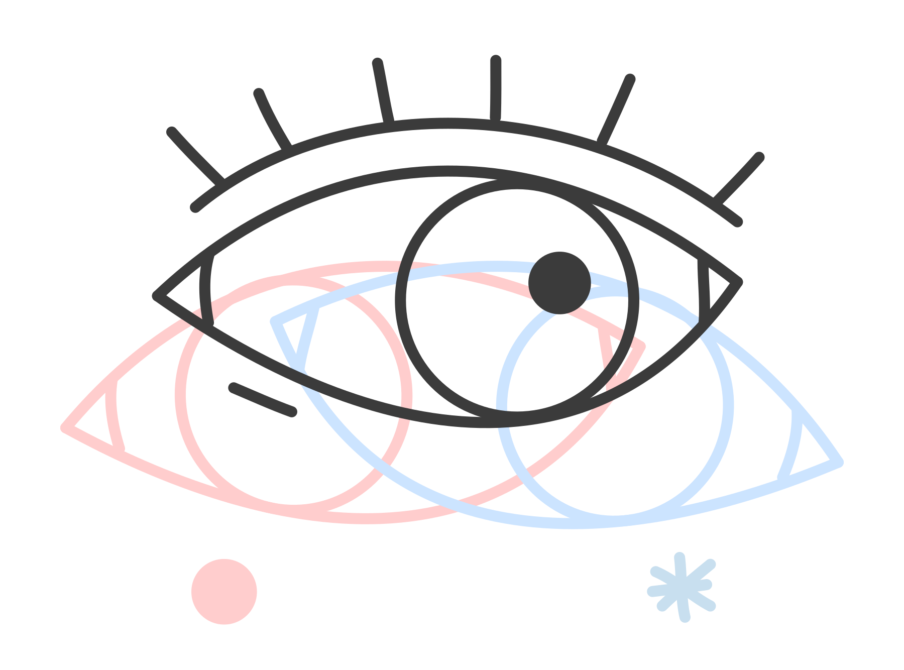

> work in progress

# nuance

<p align="center" style="margin-top:20px">
    
</p>

<p align="center">
  Linear transit search in stellar variability and correlated noises 
  <br>
  <p align="center">
    <a href="https://github.com/lgrcia/nuance">
      
    </a>
    <a href="">
      
    </a>
  </p>
</p>

*nuance* uses linear models and gaussian processes (using the [JAX](https://github.com/google/jax)-based [tinygp](https://github.com/dfm/tinygp)) to simultaneously **search for planetary transits while modeling correlated noises** (e.g. stellar variability) in a tractable way.

## Example

```python
from nuance import Nuance
from nuance import Nuance
from tinygp import kernels, GaussianProcess

time, diff, diff_error = ...
# linear model design matrix
X = ...

# defining a gaussian process
kernel = kernels. ...
gp = GaussianProcess(kernel, time, diag=diff_error**2)
nu = Nuance(time, diff_flux, gp, X.T)

# Linear Search
# -------------
t0s = time.copy()
durations = np.linspace(0.01, 0.1, 10)
ll, depth, depth_var = nu.linear_search(t0s, durations)

# Periodic Search
# ---------------
periods = np.linspace(1, 5, 5000)
llc, llv = nu.periodic_search(periods)

# result
i, j = np.unravel_index(np.argmax(llv), llv.shape)
period = periods[i]
t0, duration = nu.best_periodic_transit(p0)
```

full examples in [docs/notebooks]("docs/notebooks/")

## Installation

*nuance* is written for python 3 and can be installed **locally** by cloning this repository

```shell
git clone https://github.com/lgrcia/nuance.git
pip install -e nuance
```
