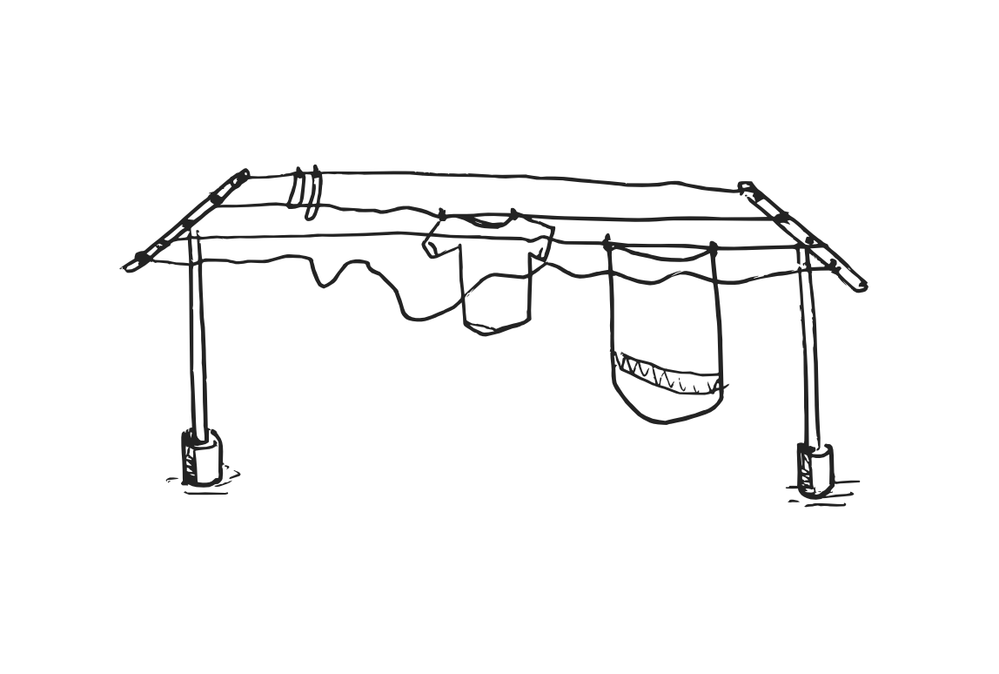

# nuance
Efficient detection of planets transiting quiet or active stars

<p align="center">
    
</p>

*nuance* uses linear models and Gaussian processes (using the [JAX](https://github.com/google/jax)-based [tinygp](https://github.com/dfm/tinygp)) to simultaneously **search for planetary transits while modeling correlated noises** (e.g. stellar variability) in a tractable way. See [the paper](https://arxiv.org/abs/2402.06835) for more details.

When to use *nuance*?
- To detect single or periodic transits
- When correlated noises are present in the data (e.g. stellar variability or instrumental systematics)
- For space-based or sparse ground-based observations
- To effectively find transits in light curves from multiple instruments
- To use GPUs for fast transit searches

Documentation at [nuance.readthedocs.io](https://nuance.readthedocs.io)

## Example

```python
import numpy as np
from nuance import linear_search, periodic_search, core

# linear search
epochs = time.copy()
durations = np.linspace(0.01, 0.2, 15)
ls = linear_search(time, flux, gp=gp)(epochs, durations)

# periodic search
periods = np.linspace(0.3, 5, 2000)
snr_function = jax.jit(core.snr(time, flux, gp=gp))
ps_function = periodic_search(epochs, durations, ls, snr_function)
snr, params = ps_function(periods)

t0, D, P = params[np.argmax(snr)]
```

## Installation

`nuance` is written for python 3 and can be installed using pip

```shell
pip install nuance
```

or from sources
  
```shell
git clone https://github.com/lgrcia/nuance
cd nuance
pip install -e .
```

## Citation

If you find *nuance* useful for your research, cite [Garcia et. al 2024](https://ui.adsabs.harvard.edu/abs/2024AJ....167..284G). The BibTeX entry for the paper is:

```
@ARTICLE{2024AJ....167..284G,
       author = {{Garcia}, Lionel J. and {Foreman-Mackey}, Daniel and {Murray}, Catriona A. and {Aigrain}, Suzanne and {Feliz}, Dax L. and {Pozuelos}, Francisco J.},
        title = "{nuance: Efficient Detection of Planets Transiting Active Stars}",
      journal = {\aj},
     keywords = {Exoplanet detection methods, Stellar activity, Time series analysis, Gaussian Processes regression, Computational methods, GPU computing, 489, 1580, 1916, 1930, 1965, 1969, Astrophysics - Earth and Planetary Astrophysics, Astrophysics - Instrumentation and Methods for Astrophysics},
         year = 2024,
        month = jun,
       volume = {167},
       number = {6},
          eid = {284},
        pages = {284},
          doi = {10.3847/1538-3881/ad3cd6},
archivePrefix = {arXiv},
       eprint = {2402.06835},
 primaryClass = {astro-ph.EP},
       adsurl = {https://ui.adsabs.harvard.edu/abs/2024AJ....167..284G},
      adsnote = {Provided by the SAO/NASA Astrophysics Data System}
}
```